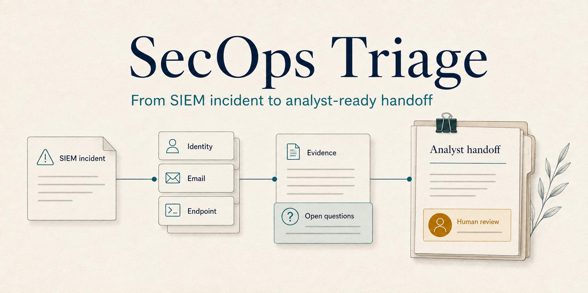

# SecOps Triage



**From SIEM incident to analyst-ready handoff.**

A Tier 1 analyst needs to decide what an incident warrants: a supported close recommendation, escalation, or a handoff with unresolved questions. SecOps Triage gathers incident context and source evidence, assembles a cited investigation, and leaves the decision with the analyst.

Built with the **Strands Agents SDK**. The working demo uses synthetic replay records for suspicious sign-ins, reported phishing and endpoint alerts. Its focus is a reviewable investigation of an incident that already exists in a SIEM.

## The analyst workflow

1. **Start with the incident.** Inspect the source incident, affected identities and devices, relevant activity and prior cases.
2. **Examine the evidence.** Keep source citations, authorization scope, intelligence matches and missing context visible. Similar messages do not inherit each other's approval; a click does not establish credential theft.
3. **Review the handoff.** Read the recommendation, findings, open questions and draft case note. Host-only APIs can record a local close/escalate decision or an unresolved handoff. The upstream SIEM remains unchanged.

The current interface is a CLI and Markdown report. A browser workspace, live source connectors and upstream response actions are not implemented. The cover image is a conceptual illustration.

## What judges can verify today

| Evidence | What it establishes |
|---|---|
| [287 passing tests](outputs/secops-rename-validation.json) | Deterministic safety and scripted/fake-provider integration on the verified build. |
| [One historical live-model investigation](docs/SECOPS-COMPLETED-INVESTIGATION.md) | Real Strands/OpenAI execution over synthetic replay: nine evidence reads and an escalation recommendation. Two earlier stopped attempts remain preserved. |
| [Nine draft cases](docs/SECOPS-CASE-MATRIX-AND-CAMPAIGN.md) | Close, escalate and unresolved scenarios across three alert families. Owner case acceptance and semantic reviews remain pending. |
| [Durable campaign accounting](docs/SECOPS-CAMPAIGN-ACCOUNTING.md) | Bound plans, runs, grants and results; failures and uncertain spend cannot silently retry. No real campaign is authorized. |

A scripted run verifies orchestration, not model judgment. The historical live result is not a reliability claim for the current build. Analyst time savings and production accuracy have not been measured.

## Walk through the phishing case

The hero case contains two similar messages: the first is explicitly authorized; the follow-up has a different URL, a recorded click and matching malicious intelligence. The reviewer must distinguish that evidence from an expired domain assessment and avoid inferring credential submission.

Use Python 3.11+ on macOS/Linux and [uv](https://docs.astral.sh/uv/). Run from the repository root, choosing new output directories each time:

```sh
uv sync --frozen --extra agent
uv run --frozen --extra agent python -m secops_triage.live prepare --case case-04 --output data/hero-source
uv run --frozen --extra agent python -m secops_triage investigate data/hero-source/incident.json --strands --output data/hero-scripted
```

Open `data/hero-scripted/investigation.md`. Preparation issues no grant; `--strands` here uses a **scripted provider with no paid model calls**. Expected demo policy: escalation with unresolved evidence context. The scripted finding is deliberately minimal and does not pass a complete semantic review. See the [evaluation guide](docs/SECOPS-EVALUATION-READINESS.md).

## Run the incident demo

Python 3.11+ on macOS/Linux; this slice needs no dependencies or credentials. Choose a new output directory for each CLI run:

```sh
python3 -m secops_triage demo --output data/incident-demo-1
```

Open `data/incident-demo-1/investigation.md` to inspect the entities, event timeline, per-alert findings, missing context, source evidence links and draft case note. `packet.json` contains the structured result. The private `owner.json` is for local host access only; do not share it.

To investigate a normalized local incident snapshot:

```sh
python3 -m secops_triage investigate incident.json --output data/imported-incident-1
```

This imports an existing incident; it does not create an incident in a SIEM. No live connector, paid model, upstream case write or containment action runs. See [contracts, limits and analyst review](docs/SECOPS-REPLAY.md).

## Try the analyst walkthrough

[Walkthrough and scoring guide](docs/SECOPS-ANALYST-WALKTHROUGH.md): generate three matched phishing cases with manual source views and assembled reports using `python3 -m secops_triage.drill --output data/new-analyst-drill`. This is zero-cost deterministic replay; observations remain empty until an analyst participates.

## Verify the SecOps slice

```sh
python3 -m unittest discover -s tests -p test_secops_triage.py -v
```

The tests include 30 synthetic cases across all three families, a combined incident, source failures, stale coverage, evidence tampering, run isolation, replay, concurrency and process-crash recovery. These establish demo behavior, not production detection accuracy or measured time savings.

The original migration implementation and its tests remain intact below. It is a preserved technical baseline, not the active product workflow.

<details>
<summary>Preserved Migration Proof baseline (historical)</summary>

## Preserved Migration Proof baseline

Evidence-backed acceptance for software migrations. The deterministic fixture demonstrates a green ordinary test suite alongside a cross-tenant authorization regression.

Phase 2 implements the local deterministic acceptance backend. Phase 3 now adds a real Strands loop with an explicitly scripted offline provider. Historical bounded migration live-test results are documented in `docs/OPENAI-LIVE-RESULT.md`. The SecOps replay does not invoke a model.

## Verify

Python 3.11+ on macOS or Linux; standard library only. Tests need permission to bind ephemeral localhost sockets.

```sh
python3 -m unittest discover -s tests -v
python3 -m migration_proof.probe
```

The probe must report `403 → 200 with synthetic leaked fields → 403`. The expanded suite includes real HTTP checks, generated-regression execution, promotion rollback, concurrent replay, and subprocess crash recovery.

## Offline Strands integration

```sh
uv sync --frozen --extra agent
uv run --frozen --extra agent python -m unittest discover -s tests -v
```

The `agent` extra pins Strands 1.54.0; `uv.lock` records its dependency graph and hashes. Without this extra, the standard-library tests still run and agent tests explicitly skip. Full verification requires the extra and zero skips. See [Phase 3 integration and limits](docs/PHASE3.md) for `run_offline` usage and the remaining live-provider gate.

## Local API

Use a private local filesystem directory (no symlinks) for `Store`. Keep SQLite and its artifact directory together. Never send the returned owner token to an agent.

```python
from migration_proof.core.store import Store
from migration_proof.core.contracts import InspectInput, BaselineInput, CompareInput

store = Store("data/local-acceptance")
run = store.create_run("corrected")
run_id, token = run["run_id"], run["token"]
tools = store.agent_tools(run_id, token)

tools["inspect_candidate"](InspectInput(run_id, "corrected"))
tools["run_baseline_tests"](BaselineInput(run_id, run["digest"]))
tools["compare_tenant_boundary"](
    CompareInput(run_id, run["original_digest"], run["digest"])
)
packet = store.assemble_decision_packet(run_id, token, run["digest"])
assert packet["ready"]
```

Only an explicit human decision should call the separate backend methods `approve(run_id, token, packet_id, actor)` and `promote(run_id, token, approval_id, idempotency_key)`. Promotion changes only that run's local SQLite accepted-release pointer. There are exactly four entries in `tools`; approval, replacement, packet assembly, and promotion are absent.

For a faulty candidate, a failed comparison blocks acceptance. `apply_safe_patch(PatchInput(...))` accepts the parsed new-file diff defined by `SAFE_PATCH` in `core/artifacts.py`. It adds the one audited regression test to an immutable derived snapshot. The test fails on the faulty application. An owner can then call `replace_candidate(..., "corrected", actor)` to carry the generated test forward; all gates must run again before approval.

See [Phase 2 architecture and review](docs/PHASE2.md), [handoff](docs/HANDOFF.md), and [build runbook](docs/runbooks/migration-proof-build-release-demo-runbook.md). Owner review remains required before any model integration.

</details>

## AWS integration status

Ohio (`us-east-2`) is the selected deployment region. A private EC2/EBS/SSM/CloudWatch package and scripted smoke helper are prepared; AWS deployment and service verification remain pending. See the [AWS integration procedure](docs/runbooks/secops-aws-integration-runbook.md). Local verification is not cloud execution evidence.
