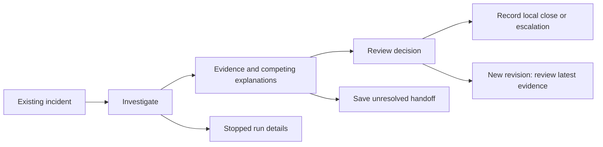

# SecOps analyst flow: Impeccable consultation

Date: 2026-09-07. Target: the Markdown investigation and planned M3 analyst workspace at source commit 570512542edff981536ea760b7cc272a934a02c5. Product direction confirmed by the owner: calm, compact workbench, plain language, keyboard access and non-color-only state labels. PRODUCT.md records that context.

This is a product-flow consultation using Impeccable's product register and cognitive-load guidance, with an independent reviewer. It is not the full browser critique command or a visual/a11y audit: no browser application, CSS or interactive components exist. Detector findings, Nielsen numerical scores, screenshots and user task timings would be misleading here and are not claimed. DESIGN.md remains pending; Impeccable document can capture the visual system when implementation is shaped. No theme or palette is selected from the security category alone.

## Judgment

The existing report is a useful export and evidence archive. It is too repetitive and navigation-heavy to become the primary analyst workspace unchanged. The main opportunity is to keep the decision, competing explanation and exact evidence together while preserving a clear unresolved path.

## Priority issues

1. **High: unresolved evidence has no saved handoff action.** The exercise accepts needs_review, but store.review only permits close or escalate. Add a separate durable handoff/draft record with actor, packet revision, reason, missing context and next action. Saving a handoff must not transition to reviewed or impersonate a final decision. The backend is now implemented as Store.save_handoff; see docs/SECOPS-UNRESOLVED-HANDOFF.md. The browser control remains proposed.
2. **High: assessment disagreement is separated from the headline recommendation.** report.py leads with the deterministic result and only later shows model disagreement. Put disagreement next to the suggested decision with both interpretations visible. A correct policy outcome must not disguise a model failure.
3. **Medium: repeated evidence increases reconstruction work.** The handoff, per-alert analysis and case note repeat the same observations. Use three adjacent groups: Supports escalation, Supports authorized activity, Still unknown. Keep the long report as an export.
4. **Medium: status mixes completion and resolution.** Use distinct labels for collection, evidence sufficiency and analyst disposition. Keep source incident, snapshot time, execution/data mode and revision visible. A newer revision blocks saving an old decision and points to the latest evidence.
5. **Medium: opaque citation labels obscure the question being checked.** Use “View message authorization” or “View intelligence query result,” opening the exact record beside the claim. Keep source/query, event ID, target, time, coverage and hash available in detail. An unavailable query must look different from a successful empty query.

## Proposed primary flow

The handoff branch now has host persistence; its UI remains new work. None of these proposed UI controls currently exists. No branch changes the source SIEM.

Persistent header: incident identity, snapshot time, data/execution labels and revision. Main area: the current task and three evidence groups. Adjacent decision area: unresolved questions, editable note and explicit disposition. Source detail opens inline or in an adjacent panel, preserving the selected claim and draft. A narrow layout stacks these areas in the same reading order.

| State | Main content | Primary action |
|---|---|---|
| Incident selected | Source identity and available snapshot | Investigate incident |
| Collecting | Actual completed/current checks; no invented percentage | Investigation in progress, disabled |
| Packet ready | Suggested decision, disagreements and source coverage | Review decision |
| Close selected | Reason, note and local-only effect | Record local close decision |
| Escalate selected | Reason, unresolved questions and next action | Record local escalation decision |
| Insufficient evidence | Missing source, consequence and next check | Save needs-review handoff; host persistence exists, UI pending |
| Failed/interrupted | Observed failure stage and retained evidence | View run details |
| Superseded packet | Change in revision and preserved draft/context | Open latest revision |
| Decision saved | Actor, timestamp, reason and exact packet | Copy case note |

“Review decision” opens a form; it does not record acceptance. Avoid ambiguous “Accept” controls. Retry appears only when the execution path and any required spending authority actually permit it.

## Proposed acceptance tasks

Current hero guidance: follow docs/SECOPS-WORKFLOW-ALIGNMENT.md for evaluation case-04. Its training and follow-up messages are distinct; the conflict exercise below is a separate scenario. Actual analyst feedback is waived by the owner; these tasks remain design checks, not recorded user observations.

- Conflict: find both same-message authorization and threat evidence, explain the strongest benign alternative, and prepare an escalation without claiming compromise.
- Authorized: verify machine-readable exact scope and coverage before recording a bounded local close reason. This requires the planned authorization-contract improvements.
- Missing intelligence: distinguish unavailable from empty results and save an unresolved handoff without forcing a disposition.
- Save/reload: recover the same actor, note, disposition and packet. Duplicate submission produces no duplicate record; failed save preserves the draft.
- New revision: detect supersession while a decision is open and inspect current evidence before saving. Preserve the old draft as historical, never silently apply it to new evidence.
- Complete the workflow without terminal commands or facilitator navigation. Record real completion, wrong-target citations, critical errors, corrections and source opens. Separate loading/collection time from analyst effort.

## Proposed accessibility checks

Keyboard-only completion; logical focus order; visible focus and no traps. Evidence opening focuses its detail heading and closing returns to the originating citation. Status/save/failure announcements occur once without stealing focus. Labels distinguish collection, gaps, disagreement and stale/saved decisions without color. Each source link has a meaningful distinct accessible name. Errors are associated with their controls and preserve input. Test contrast, zoom, reflow and sticky-region occlusion in the implemented browser UI. These are acceptance requirements, not verified conformance.

## Boundary of the consultation

This review supports the proposed interaction structure. It does not establish visual quality, real-world authorization validity, source accuracy, model entailment or analyst productivity. The independent plan review and revised gate sequence are in outputs/secops-independent-plan-review.md and docs/runbooks/secops-demo-completion-runbook.md.
